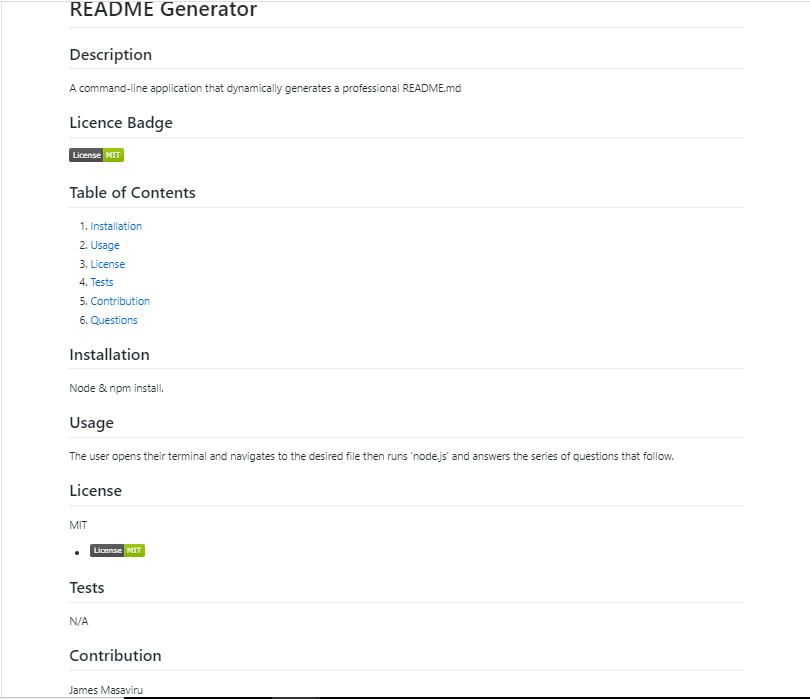

# README Generator

  ## Description
  A command-line application that dynamically generates a professional README.md from a user's input using the inquirer package.

  ## Licence Badge
  
  
  ## Table of Contents
  1. [Installation](#installation)
  2. [Usage](#usage)
  3. [License](#license)
  4. [Tests](#testing)
  5. [Contribution](#contribution)
  6. [Questions](#questions)

  ## Installation
  Node & npm install.

  ## Usage
  The user opens their terminal and navigates to the desired file then runs 'node.js' and answers the series of questions that follow about the application repository. Upon completion of the questions a quality, professional README.md is generated with all the required attributes. 

  

  >The table of contents above is created and populated with the corresponding user input. 

  ## License
  MIT
  *  
 
  ## Tests
  N/A

  ## Contribution
  James Masaviru
  
  ## Questions
  * If you have questions, email me at: jmasaviru@gmail.com,
  * GitHub Profile link: https://github.com/jmasaviru

## Links

* Video link for demonstration: https://drive.google.com/file/d/1ZaSaQK2tSm5JrfMJraZW_0KiJDIBa2vk/view

* README Generator GitHub repository URL: (https://github.com/jmasaviru/README-Genreator)